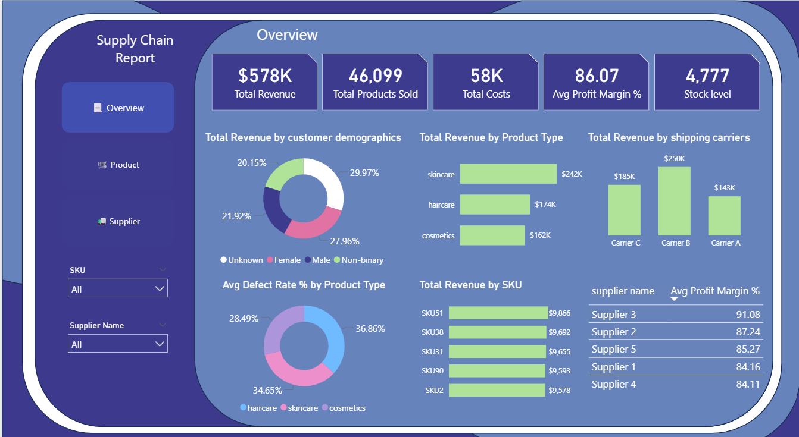
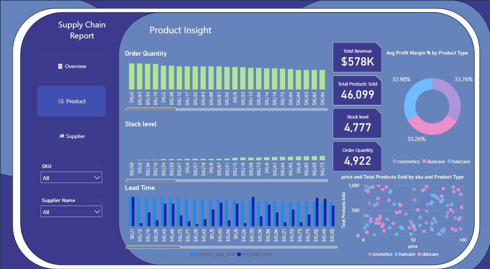
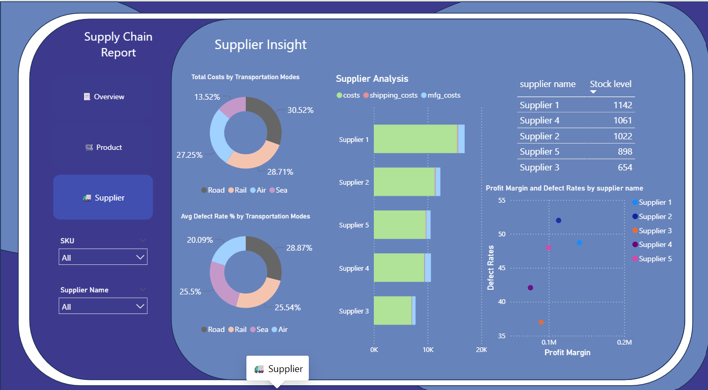

# 📦 Supply Chain Analytics Dashboard

## 📌 Overview
This project presents an end-to-end data analytics pipeline for supply chain data, transforming raw data into actionable insights for better business decision-making.

The project includes data cleaning, ETL processing, database integration using MySQL, and an interactive dashboard.

---

## 🧠 Project Workflow
1. Data Collection (Kaggle dataset)  
2. Data Cleaning & Exploration using Python  
3. ETL Process (Extract, Transform, Load)  
4. Data Storage in MySQL  
5. Data Analysis using SQL  
6. Dashboard Development  

---

## ⚙️ Tools & Technologies
- Python (Pandas, NumPy)
- MySQL
- SQL
- Power BI
- Jupyter Notebook

---

## 🔄 ETL Process
- Extracted raw dataset  
- Cleaned missing values and handled inconsistencies  
- Transformed data into structured format  
- Loaded data into MySQL for efficient querying  

---

## 📖 Data Story
In today’s supply chain environment, efficiency is not just about delivering products — it is about balancing cost, speed, quality, and demand.

While Skincare products generate the highest revenue, Haircare products show the highest defect rates, indicating quality concerns despite strong sales.

Supplier performance varies significantly, with Supplier 3 achieving high profitability, while others struggle with quality issues. On the logistics side, Carrier B leads in revenue, but reveals trade-offs between cost, delivery speed, and product quality.

Additionally, low stock levels for high-demand products highlight weaknesses in demand forecasting, while gaps between manufacturing and delivery times suggest inefficiencies in operations.

Overall, the analysis shows that success in supply chain management depends on balancing profitability, quality, and operational efficiency.

---

## 🎯 Key Takeaways
- High revenue does not always indicate high quality  
- Supply chain performance varies across suppliers and carriers  
- Inventory and logistics inefficiencies impact overall performance  

---

## 📊 Dashboard Pages

### 🔹 Overview

Provides a high-level summary of KPIs, revenue distribution, and shipping performance.

---

### 🔹 Product Analysis

Focuses on product demand, stock levels, and lead time analysis.

---

### 🔹 Supplier Analysis

Analyzes supplier performance, defect rates, and cost distribution.

---
## 🎯 Project Value
This project demonstrates:
- End-to-end data pipeline development  
- Database integration (MySQL)  
- Data visualization and dashboard design  
- Business-oriented data analysis  

---

## 🔗 Dataset Source
This dataset is sourced from Kaggle:  
[Kaggle Supply Chain Analysis Dataset](https://www.kaggle.com/code/amirmotefaker/supply-chain-analysis/input)
